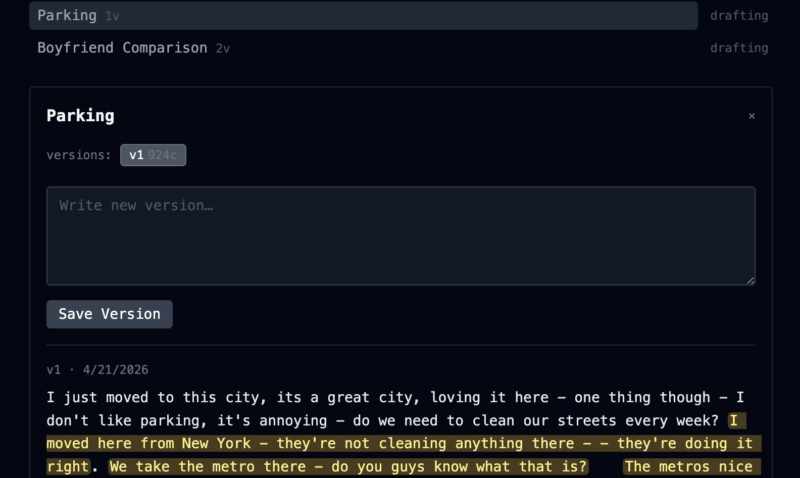
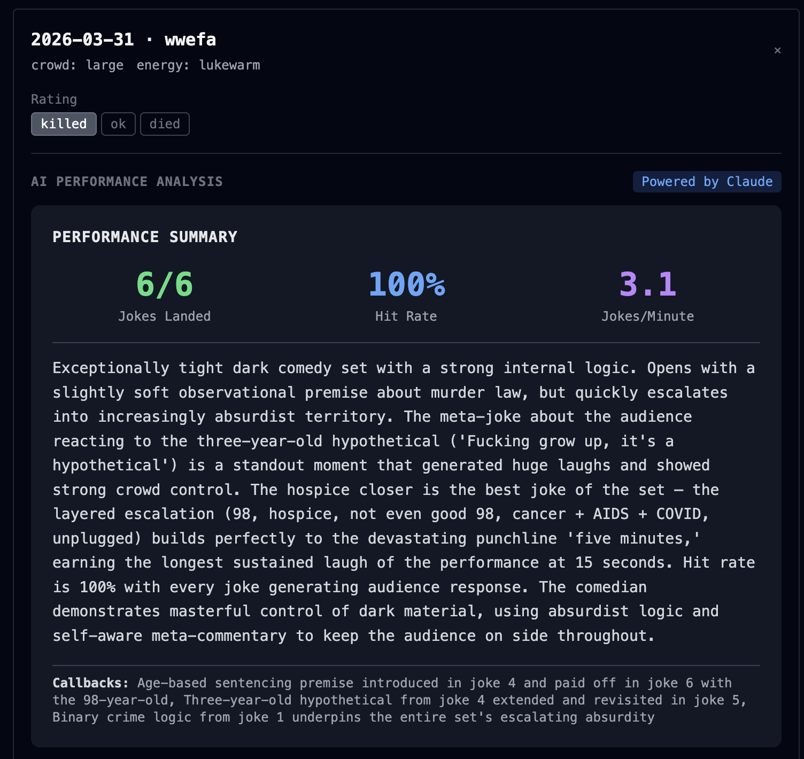
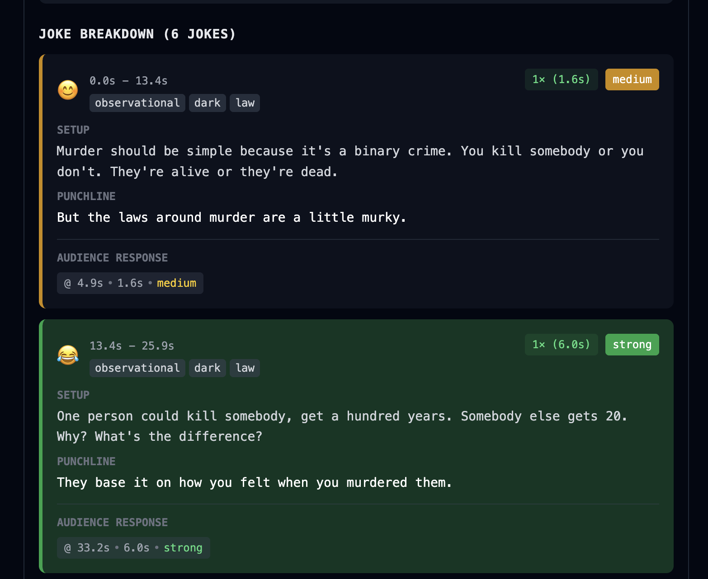

# Comedy Set Tracker

[](LICENSE)
[](https://www.python.org/)
[](https://react.dev/)
[](https://fastapi.tiangolo.com/)

A production-grade PWA for standup comedians to track material evolution, assemble sets, and analyze show recordings with ML-powered laugh detection and transcription.

## ✨ Features

- **Version-controlled material** — Immutable version history for every joke/bit with character-level annotations
- **Audio delivery memos** — Record and attach voice notes to specific lines to capture tone and delivery
- **Set assembly** — Drag-and-drop interface to build ordered sets from specific bit versions
- **Show analysis** — Upload recordings for automatic Whisper transcription + laugh detection on GPU
- **Laugh heatmaps** — Per-line laugh scores visualized with color-coded intensity bars
- **Material diffing** — Compare planned set text vs. actual performance with structured diff view
- **Lines notebook** — Separate scratchpad for unstructured ideas and brain dumps
- **PWA-ready** — Install to phone home screen for mobile access

## 🏗️ Architecture

```
Browser (PWA)
     │
     │  HTTP (same-origin in prod, CORS in dev)
     ▼
FastAPI (Railway)
     ├── SQLite on persistent volume
     ├── Cloudflare R2 (audio storage)
     └── Modal (serverless GPU)
              │
              └── Whisper large-v3 + laugh detection
```

**Key architectural decisions:**
- Single-user deployment (no authentication)
- Monorepo structure with backend/frontend separation
- Immutable versioning enforced at API layer
- Async ML processing with callback pattern (no polling overhead)
- Railway persistent volume for SQLite + R2 for audio

## 🛠️ Tech Stack

### Backend
- **FastAPI** 0.111+ — Modern async Python web framework
- **SQLModel** 0.0.19+ — ORM combining SQLAlchemy + Pydantic
- **SQLite** — Embedded database on Railway persistent volume
- **Uvicorn** 0.29+ — ASGI server with auto-reload
- **boto3** 1.34+ — S3-compatible client for Cloudflare R2
- **Modal** 1.0+ — Serverless GPU functions (Whisper + ML)
- **Anthropic SDK** 0.40+ — Claude integration for joke analysis

### Frontend
- **React** 18.3 — Component-based UI library
- **Vite** 5.4 — Fast build tool with HMR
- **Tailwind CSS** 3.4 — Utility-first CSS framework
- **MediaRecorder API** — Browser-native audio recording

### ML Pipeline
- **faster-whisper** 1.0.3 — Optimized Whisper transcription on GPU
- **PyTorch** — Deep learning framework (CUDA 12.1)
- **librosa** — Audio feature extraction
- **Modal T4 GPU** — Serverless compute for analysis jobs

### Infrastructure
- **Railway** — Hosting with persistent volumes
- **Cloudflare R2** — S3-compatible object storage
- **Docker** — Multi-stage build (Node 20 → Python 3.12)

## 📋 Prerequisites

- **Python** 3.12+
- **Node.js** 20+
- **Modal account** (for ML functions) — [modal.com](https://modal.com)
- **Railway account** (for deployment) — [railway.app](https://railway.app)
- **Cloudflare R2 bucket** (for audio storage) — [cloudflare.com/r2](https://www.cloudflare.com/products/r2/)

## 🚀 Installation

### 1. Clone the repository
```bash
git clone https://github.com/yourusername/jokestracker.git
cd jokestracker
```

### 2. Set up backend
```bash
cd backend
python3 -m venv .venv
.venv/bin/pip install -r requirements.txt
```

### 3. Set up frontend
```bash
cd frontend
npm install
```

### 4. Configure environment variables

**Backend** — Create `backend/.env`:
```bash
# Cloudflare R2 credentials
R2_ENDPOINT_URL=https://your-account-id.r2.cloudflarestorage.com
R2_ACCESS_KEY_ID=your_access_key_id
R2_SECRET_ACCESS_KEY=your_secret_access_key
R2_BUCKET_NAME=your_bucket_name

# Database (defaults to ./data/db.sqlite)
DATABASE_URL=sqlite:///./data/db.sqlite

# Modal configuration
MODAL_APP_NAME=jokestracker
BACKEND_BASE_URL=http://localhost:8000
```

**Frontend** — Create `frontend/.env.development`:
```bash
VITE_API_BASE=http://localhost:8000
```

### 5. Deploy Modal analysis function
```bash
# Authenticate with Modal
modal token set

# Deploy the GPU function
modal deploy backend/jobs/analyze.py
```

## 🏃 Running Locally

### Development mode (two terminals)

**Terminal 1 — Backend** (runs on `:8000`):
```bash
backend/.venv/bin/uvicorn backend.main:app --reload
```

**Terminal 2 — Frontend** (runs on `:5173`):
```bash
cd frontend && npm run dev
```

Open [http://localhost:5173](http://localhost:5173) in your browser.

### Run integration tests
```bash
# Backend server must be running
backend/.venv/bin/python backend/test_api.py
```

19 assertions covering all route groups. No mocking — tests hit real SQLite.

## 📸 Screenshots

### Material Management with Annotations
Track joke evolution with version control and character-level annotations. Each bit shows version history, and you can highlight specific text ranges with delivery notes.



### AI-Powered Performance Analysis
Upload show recordings to get Claude-powered insights on your set. See metrics like hit rate, jokes per minute, and detailed analysis of what worked.



### Joke-by-Joke Breakdown with Laugh Heatmap
Visualize audience response with color-coded laugh intensity. Each joke shows setup/punchline structure, timing, and exact laugh timestamps.



## 🗂️ Project Structure

```
jokestracker/
├── backend/
│   ├── routers/           # API route handlers (bits, sets, shows, etc.)
│   ├── jobs/              # Modal GPU functions
│   │   └── analyze.py     # Whisper + laugh detection
│   ├── models.py          # SQLModel database schemas
│   ├── storage.py         # R2 client wrapper
│   ├── main.py            # FastAPI app entry point
│   ├── test_api.py        # Integration tests
│   └── requirements.txt
├── frontend/
│   ├── src/
│   │   ├── components/    # React components (AnnotatedText, AudioRecorder, etc.)
│   │   ├── views/         # Tab views (BitsView, SetsView, ShowsView)
│   │   ├── api.js         # API client wrapper
│   │   └── App.jsx        # Root component
│   ├── package.json
│   └── vite.config.js
├── Dockerfile             # Multi-stage build (Node 20 → Python 3.12)
├── DESIGN.md              # Full system design document
└── CLAUDE.md              # Development guidelines
```

## 🔑 Environment Variables

### Backend (`backend/.env`)
| Variable | Description | Required |
|----------|-------------|----------|
| `R2_ENDPOINT_URL` | Cloudflare R2 endpoint URL | ✅ |
| `R2_ACCESS_KEY_ID` | R2 access key ID | ✅ |
| `R2_SECRET_ACCESS_KEY` | R2 secret access key | ✅ |
| `R2_BUCKET_NAME` | R2 bucket name | ✅ |
| `DATABASE_URL` | SQLite database URL | Optional (defaults to `sqlite:///./data/db.sqlite`) |
| `MODAL_APP_NAME` | Modal app name | Optional (defaults to `jokestracker`) |
| `BACKEND_BASE_URL` | Backend base URL for Modal callbacks | Optional (defaults to `http://localhost:8000`) |

### Frontend (`frontend/.env.development`)
| Variable | Description | Required |
|----------|-------------|----------|
| `VITE_API_BASE` | API base URL | Dev only (empty in production for same-origin) |

### Modal Secret
Create a Modal secret named `jokestracker-r2` with R2 credentials:
```bash
modal secret create jokestracker-r2 \
  R2_ENDPOINT_URL=your_endpoint \
  R2_ACCESS_KEY_ID=your_key \
  R2_SECRET_ACCESS_KEY=your_secret \
  R2_BUCKET_NAME=your_bucket
```

## 🏗️ Production Deployment

### Docker build
```bash
docker build -t jokestracker .
```

Multi-stage build:
1. Node 20 stage builds frontend (`npm run build` → `frontend/dist`)
2. Python 3.12 stage installs backend deps + copies frontend dist

### Railway deployment
1. Connect your GitHub repository to Railway
2. Add environment variables in Railway dashboard
3. Attach a persistent volume at `/data` (for SQLite)
4. Railway auto-deploys on push to `main` branch

Production database path: `sqlite:////data/db.sqlite` (absolute path to volume)

## 📊 Data Model

The system has three independent lineages converging at `Show`:

### Material Lineage
```
Bit → Version → Annotation (+ optional audio)
```
- **Immutable versions** — Every edit creates a new version (v1, v2, v3...)
- **Character-level annotations** — Mark text ranges with notes + delivery memos
- **Soft delete** — Bits set to `status=dead` to preserve version history

### Sets Lineage
```
ComedySet → SetVersion → SetVersionItem → references Version
```
- **Immutable set versions** — Reordering creates a new SetVersion
- **Version-specific references** — Each item points to exact bit version performed

### Shows Lineage
```
Show → AnalysisJob → AnalysisResult (ML output)
```
- **Audio upload triggers GPU job** — Whisper transcription + laugh detection
- **Async callback pattern** — Modal POSTs results when complete
- **Laugh-to-line mapping** — 3-second attribution window for laugh timestamps

See `DESIGN.md` for full architecture details and API documentation.

## 🤝 Contributing

This is a personal project, but feedback and suggestions are welcome!

1. Fork the repository
2. Create a feature branch (`git checkout -b feature/amazing-feature`)
3. Commit your changes (`git commit -m 'Add amazing feature'`)
4. Push to the branch (`git push origin feature/amazing-feature`)
5. Open a Pull Request

### Development guidelines
- Follow existing code style (see `CLAUDE.md`)
- Run integration tests before submitting PR
- Update documentation for new features
- Keep immutability invariants intact (versions, annotations, set versions)

## ⚠️ Known Limitations

- **Laugh detection:** LaughterSegmentation model not yet pip-installable — currently returns `[]`
- **Audio cleanup:** Deleting annotations/shows doesn't delete R2 objects (storage grows indefinitely)
- **Job retry:** Failed Modal jobs stay `failed` — no automatic retry mechanism
- **No pagination:** All list endpoints return full collections (personal app assumption)
- **Diff alignment:** Fuzzy word matching can misalign on heavily improvised performances

## 📝 License

License not specified. Please add a LICENSE file to clarify usage rights.

## 🔗 Links

- **Design Document:** [DESIGN.md](DESIGN.md)
- **Development Guide:** [CLAUDE.md](CLAUDE.md)
- **Modal Documentation:** [modal.com/docs](https://modal.com/docs)
- **FastAPI Documentation:** [fastapi.tiangolo.com](https://fastapi.tiangolo.com/)

---

**Built with** ❤️ **for standup comedians tracking their craft**
